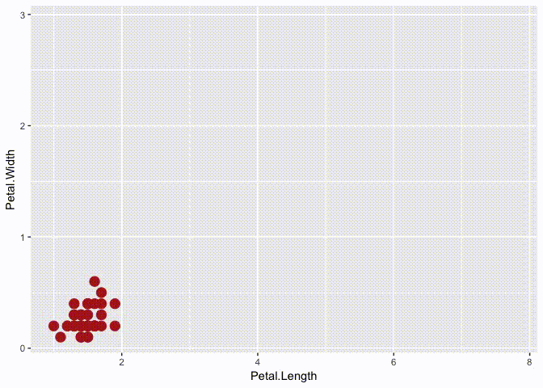
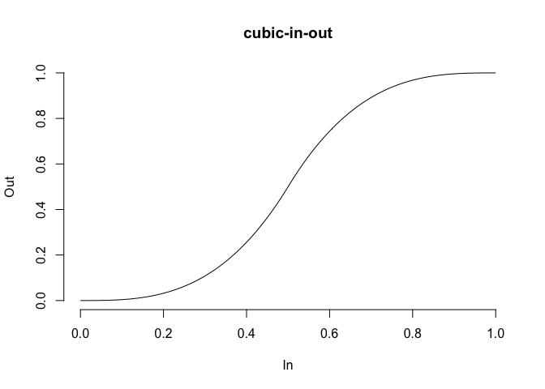

<!-- README.md is generated from README.Rmd. Please edit that file -->
tweenr 
=======================================================

[](https://travis-ci.org/thomasp85/tweenr) [](https://ci.appveyor.com/project/thomasp85/tweenr) [](https://CRAN.R-project.org/package=tweenr) [](https://CRAN.R-project.org/package=tweenr)

What is this?
-------------

`tweenr` is a package for interpolating data, mainly for animations. It provides a range of functions that take data of different forms and calculate intermediary values. It supports all atomic vector types along with `factor`, `Date`, `POSIXct`, characters representing colours, and `list`. `tweenr` is used extensibly by [`gganimate`](https://github.com/thomasp85/gganimate) to create smooth animations, but can also be used by itself to prepare data for animation in another framework.

How do I get it?
----------------

`tweenr` is available on CRAN and can be installed with `install.packages('tweenr')`. In order to get the development version you can install it from github with `devtools`

``` r
#install.packages('devtools')
devtools::install_github('thomasp85/tweenr')
```

An example
----------

Following is an example of using the pipeable `tween_state()` function with our belowed iris data:

``` r
library(tweenr)
library(ggplot2)

# Prepare the data with some extra columns
fade <- function(df) {
  df$size <- 0
  df$alpha <- 0
  df
}
iris$col <- c('firebrick', 'forestgreen', 'steelblue')[as.integer(iris$Species)]
iris$size <- 4
iris$alpha <- 1
iris <- split(iris, iris$Species)

# Here comes tweenr
iris_tween <- iris$setosa %>% 
  tween_state(iris$versicolor, ease = 'cubic-in-out', nframes = 30, 
              enter = fade, exit = fade) %>% 
  keep_state(10) %>% 
  tween_state(iris$virginica, ease = 'elastic-out', nframes = 30, 
              enter = fade, exit = fade) %>% 
  keep_state(10) %>% 
  tween_state(iris$setosa, ease = 'quadratic-in', nframes = 30, 
              enter = fade, exit = fade) %>% 
  keep_state(10)

# Animate it to show the effect
p_base <- ggplot() + 
  geom_point(aes(x = Petal.Length, y = Petal.Width, alpha = alpha, colour = col, 
                 size = size)) + 
  scale_colour_identity() +
  scale_alpha_identity() + 
  scale_size_identity() + 
  coord_cartesian(xlim = range(iris_tween$Petal.Length), 
                  ylim = range(iris_tween$Petal.Width))
iris_tween <- split(iris_tween, iris_tween$.frame)
for (d in iris_tween) {
  p <- p_base %+% d
  plot(p)
}
```



Other functions
---------------

Besides the `tween_state()`/`keep_state()` combo showcased above, there are a slew of other functions meant for data in different formats

**`tween_components`** takes a single data.frame, a vector of ids identifying recurrent elements, and a vector of timepoints for each row and interpolate each element between its specified time points.

**`tween_events`** takes a single data.frame where each row encodes a single unique event, along with a start, and end time and expands the data across a given number of frames.

**`tween_along`** takes a single data.frame along with an id and timepoint vector and calculate evenly spaced intermediary values with the possibility of keeping old values at each frame.

**`tween_at`** takes two data.frames or vectors along with a numeric vector giving the interpolation point between the two data.frames to calculate.

**`tween_fill`** fills missing values in a vector or data.frame by interpolating between previous and next non-missing elements

Easing
------

In order to get smooth transitions you'd often want a non-linear interpolation. This can be achieved by using an easing function to translate the equidistant interpolation points into new ones. `tweenr` has support for a wide range of different easing functions, all of which can be previewed using `display_ease()` as here where the popular *cubic-in-out* is shown:

``` r
tweenr::display_ease('cubic-in-out')
```



Spatial interpolations
----------------------

The purpose of `tweenr` is to interpolate values independently. If paths and polygons needs to be transitioned the [`transformr`](https://github.com/thomasp85/transformr) package should be used as it expands tweenr into the spatial realm
